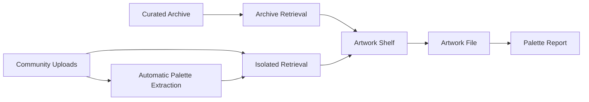
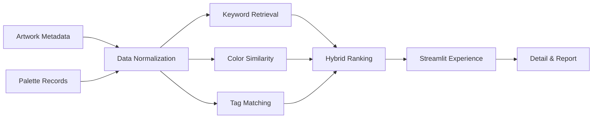

<div align="center">

<div align="center">
<div align="center">


# PaletteSeek

### 色彩智慧，艺术精选。

</div>

</div>

从绘画、电影海报与视觉艺术中提取色彩线索
将模糊的审美意图转译为可检索、可比较、可落地的配色档案。

[Explore PaletteSeek](https://paletteseek.streamlit.app/)

</div>


## Why PaletteSeek

找颜色从来不只是找一个 HEX。

设计师真正需要的，是一套颜色为什么成立：它来自怎样的作品，承载什么情绪，如何形成比例，又能被迁移到怎样的视觉场景。

传统色板工具善于生成颜色，却常常丢失语境。图片搜索提供语境，却难以精确比较。PaletteSeek 试图连接两者：

> 用检索理解审美，用艺术作品保存颜色的上下文。

用户可以从一个词、一种情绪或一个目标颜色出发，在真实作品中寻找相近的视觉答案，并继续进入作品档案、色卡结构与分析报告。

## The Experience

- **Search by intent**
  用关键词、情绪与使用场景描述目标，例如 `深蓝 冷静 科技 海报 not 暖色`。

- **Search by color**
  
  输入 HEX 或使用取色盘，基于 CIELab、Delta-E 与颜色占比寻找相近作品。
  
- **Search across signals**
  
  混合检索综合颜色、标签与文本相关度，回答“适合文化展览的低饱和蓝绿色视觉”这类创作问题。

## From Results to Decisions

PaletteSeek 不止返回一排图片。

每件作品都会被整理为一份可以继续使用的色彩档案：

- 作品原图与来源语境
- 主色 HEX 与颜色占比
- 整体色调与主色系
- 文化、分类、媒介与风格标签
- 背景色、标题色、正文色与强调色建议
- 色彩网络、比例分布与分析报告
- 一键复制整套色值

结果区以书架方式陈列作品。悬停可以快速浏览信息，进入详情后再完成比较、判断与色值复用。

## Open, Without Polluting the Archive

艺术数据库需要开放增长，也需要可信边界。

我们的PaletteSeek 将内容分为两条互不混杂的数据路径：

| Collection | Role | Default Search |
|---|---|---|
| **Curated Archive** | 经过项目整理与标注的正式馆藏 | Included |
| **Community Uploads** | 用户上传图片与自填元数据 | Isolated |

用户上传作品可以复用调色盘提取、独立检索、详情浏览和分析报告，但不会进入正式馆藏检索。

这种结构让系统在降低人工收录成本的同时，不必牺牲正式数据的可信度。



## Product Capabilities

- **Hybrid Retrieval**：关键词、语义标签与颜色相似度联合排序
- **Faceted Discovery**：按色调、色系、文化与分类缩小范围
- **Artwork Shelf**：强调作品封面与色彩气质的策展式浏览
- **Palette Intelligence**：主色提取、比例呈现与用途建议
- **Artwork Files**：将图像、元数据、标签与来源组织为统一档案
- **Visual Reports**：生成颜色关系网络与比例分析
- **Community Uploads**：自动提色，并在独立数据区内完成检索与分析
- **Design Handoff**：复制完整 HEX 组合，快速进入实际创作

## Design Principles

- 颜色不是孤立变量。作品、年代、文化和视觉用途共同构成它的意义。

- 用户不必从无限图片流中碰运气，而是可以明确表达目标并逐步缩小答案空间。

- 开放内容必须有清晰边界。未经核验的数据不会悄悄进入正式馆藏。

- 每次浏览最终都应指向一个可执行结果：可以复制的色值、可以解释的比例，以及可以迁移的视觉关系。

## System



| Layer | Technology |
|---|---|
| Experience | Streamlit |
| Data | Pandas, OpenPyXL |
| Image Processing | Pillow |
| Color Intelligence | RGB, HSV, CIELab, Delta-E |
| Reporting | Matplotlib, NetworkX |
| Current Storage | Excel and local image assets |
| Deployment | Streamlit Community Cloud |

## Run Locally

```bash
git clone https://github.com/ContraMundum-code/PaletteSeek.git
cd PaletteSeek

python3 -m venv .venv
source .venv/bin/activate
python -m pip install -r 前端/requirements.txt

streamlit run 前端/app.py
```

如果本地环境已经准备好：

```bash
source .venv/bin/activate
streamlit run 前端/app.py
```

## Repository

```text
PaletteSeek/
├── 前端/
├── 后端/
├── docs/
├── 参考文献/
├── requirements.txt
├── packages.txt
└── README.md
```

## Deployment Notes

Streamlit Community Cloud 的应用入口为：

```text
前端/app.py
```

仓库中的 `packages.txt` 提供 Linux 字体依赖，`前端/requirements.txt` 提供 Python 运行依赖。

当前用户上传数据写入本地 Excel 和图片目录，适合原型验证与演示。面向长期运行时，应迁移至持久化数据库与对象存储，并补充内容审核、重复检测与来源校验。

## Roadmap

- Persistent community collection
- Image-level duplicate detection
- Source and rights verification
- Embedding-based multimodal retrieval
- Palette comparison and collection boards
- Export workflows for design tools

## Credits

馆藏素材主要来自 Wikimedia Commons 及项目整理数据。部分作品可能缺少完整官方元数据，系统会尽可能保留原始来源链接。

PaletteSeek was initiated as an exploration of information retrieval, visual culture, and practical color intelligence.


<div align="center">
Built as a team project for the <strong>Information Storage and Retrieval</strong> course at Peking University.
<br><br>
<strong>PaletteSeek © 2026</strong>
</div>
