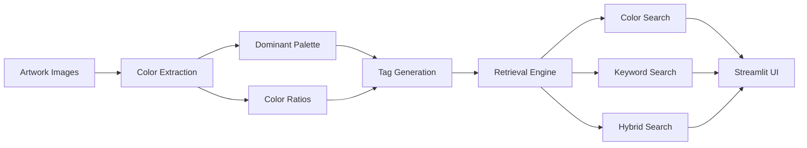

# PaletteSeek

**PaletteSeek** is an art-inspired color retrieval and recommendation system designed for visual creators.

By extracting dominant color palettes from artworks and organizing them with semantic tags, PaletteSeek transforms artistic inspiration into searchable, comparable, and reusable design assets.

🌐 Live Demo: https://paletteseek.streamlit.app/

---

## Overview

Choosing colors is one of the most challenging tasks in visual design.

Most color tools focus on generating random palettes or browsing predefined color collections. PaletteSeek takes a different approach: it uses real artworks as color sources and enables users to search for palettes through colors, styles, emotions, and design scenarios.

The project bridges information retrieval and visual design by combining:

- Color palette extraction
- Semantic tag organization
- Color similarity retrieval
- Keyword-based retrieval
- Hybrid ranking strategies

---

## Key Features

### 🎨 Dominant Color Extraction

- Extract dominant colors from artwork images
- Generate HEX color palettes
- Calculate color proportions
- Visualize palette composition

### 🔍 Multi-Modal Retrieval

#### Color Search

Find artworks with palettes similar to a target color.

Example:

```text
#1E3A8A
```

#### Keyword & Tag Search

Search using semantic concepts such as:

```text
technology
vintage
academic presentation
minimalist
warm tone
```

#### Hybrid Retrieval

Combine:

- Color similarity
- Tag matching
- Text relevance

to support more complex creative needs.

Example:

```text
Deep blue, technological, suitable for data dashboards
```

---

## Use Cases

### Data Visualization

Find palettes suitable for:

- Dashboards
- Infographics
- Business reports

### Presentation Design

Discover low-distraction and professional color schemes for:

- Academic presentations
- Research posters
- Business slides

### Poster Design

Explore high-contrast and expressive palettes inspired by artworks.

### Brand & UI Design

Retrieve palettes matching desired brand personalities such as:

- Premium
- Modern
- Vintage
- Minimalist

---

## System Architecture

```text
Data Collection
        │
        ▼
Metadata Storage
        │
        ▼
Image Processing
(Color Extraction)
        │
        ▼
Tag Organization
        │
        ▼
Retrieval & Ranking
        │
        ▼
Streamlit Interface
```

---

## Technology Stack

| Component | Technology |
|------------|------------|
| Language | Python |
| Frontend | Streamlit |
| Data Processing | Pandas |
| Image Processing | Pillow / OpenCV |
| Color Extraction | Scikit-Learn (K-Means) |
| Retrieval | TF-IDF / BM25 |
| Storage | CSV / Excel |
| Visualization | Matplotlib |

---

## Repository Structure

```text
PaletteSeek
├── 前端/
│   ├── app.py
│   └── requirements.txt
├── 后端/
│   └── paletteseek_backend/
├── 参考文献/
└── README.md
```

---

## Local Deployment

Install dependencies:

```bash
pip install -r 前端/requirements.txt
```

Run the application:

```bash
streamlit run 前端/app.py
```

---

## Project Highlights

- Artwork-based palette retrieval instead of random color generation
- Dominant color extraction using clustering algorithms
- Hybrid retrieval combining color, semantic tags, and text relevance
- Practical design-oriented recommendation scenarios
- Interactive web application built with Streamlit

---

## Future Work

- Larger artwork datasets
- CLIP-based multimodal retrieval
- Personalized recommendation mechanisms
- User feedback driven ranking optimization
- Advanced palette generation and export tools

---

## Authors

Developed as part of the Information Storage and Retrieval course group project.

PaletteSeek © 2026

## Screenshots

### Home Page — Artwork Exploration


### Home Page — Palette Discovery


