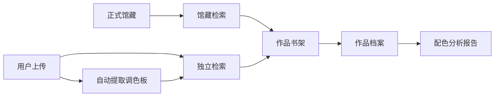
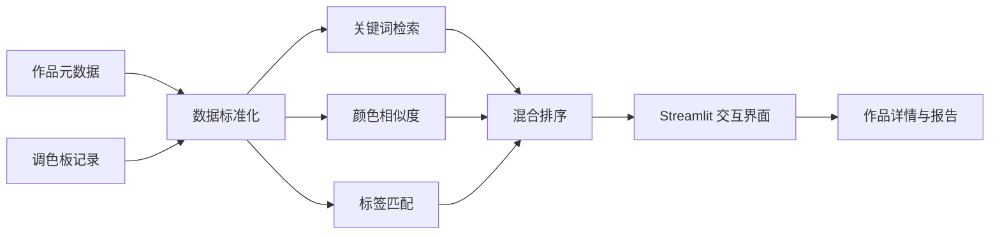

<div align="center">

<div align="center">
<div align="center">


# PaletteSeek

### 色彩智慧，艺术精选。

</div>

</div>

从绘画、电影海报与视觉艺术中提取色彩线索
将模糊的审美意图转译为可检索、可比较、可落地的配色档案。

[在线体验 PaletteSeek](https://paletteseek.streamlit.app/)

</div>


## 为什么选择 PaletteSeek

找颜色从来不只是找一个 HEX。

设计师真正需要的，是一套颜色为什么成立：它来自怎样的作品，承载什么情绪，如何形成比例，又能被迁移到怎样的视觉场景。

传统色板工具善于生成颜色，却常常丢失语境。图片搜索提供语境，却难以精确比较。PaletteSeek 试图连接两者：

> 用检索理解审美，用艺术作品保存颜色的上下文。

用户可以从一个词、一种情绪或一个目标颜色出发，在真实作品中寻找相近的视觉答案，并继续进入作品档案、色卡结构与分析报告。

## 使用方式

- **按创作意图检索**
  用关键词、情绪与使用场景描述目标，例如 `深蓝 冷静 科技 海报 NOT 暖色`。

- **按颜色检索**
  
  输入 HEX 或使用取色盘，基于 CIELab、Delta-E 与颜色占比寻找相近作品。
  
- **多信号混合检索**
  
  混合检索综合颜色、标签与文本相关度，回答“适合文化展览的低饱和蓝绿色视觉”这类创作问题。

## 从检索结果到设计决策

PaletteSeek 不止返回一排图片。

每件作品都会被整理为一份可以继续使用的色彩档案：

- 作品原图与来源语境
- 主色 HEX 与颜色占比
- 整体色调与主色系
- 文化、分类、媒介与风格标签
- 背景色、标题色、正文色与强调色建议
- 色彩网络、比例分布与分析报告
- 一键复制整套色值

结果区以书架方式陈列作品。悬停可以快速浏览信息，进入详情后再完成比较、判断与色值复用。

## 开放收录，同时保护正式馆藏

艺术数据库需要开放增长，也需要可信边界。

PaletteSeek 将内容分为两条互不混杂的数据路径：

| 数据集合 | 作用 | 默认检索状态 |
|---|---|---|
| **正式馆藏** | 经过项目整理与标注的正式数据 | 默认纳入 |
| **用户上传** | 用户上传的图片与自行填写的元数据 | 独立检索 |

用户上传作品可以复用调色盘提取、独立检索、详情浏览和分析报告，但不会进入正式馆藏检索。

这种结构让系统在降低人工收录成本的同时，不必牺牲正式数据的可信度。



## 产品能力

- **混合检索**：关键词、语义标签与颜色相似度联合排序；同时支持基础的自然语言检索
- **多维筛选**：按色调、色系、文化与分类缩小范围
- **作品书架**：强调作品封面与色彩气质的策展式浏览
- **配色分析**：主色提取、比例呈现与用途建议
- **作品档案**：将图像、元数据、标签与来源组织为统一档案
- **可视化报告**：生成颜色关系网络与比例分析
- **用户上传**：自动提色，并在独立数据区内完成检索与分析
- **设计衔接**：复制完整 HEX 组合，快速进入实际创作

## 设计原则

- 颜色不是孤立变量。作品、年代、文化和视觉用途共同构成它的意义。

- 用户不必从无限图片流中碰运气，而是可以明确表达目标并逐步缩小答案空间。

- 开放内容必须有清晰边界。未经核验的数据不会悄悄进入正式馆藏。

- 每次浏览最终都应指向一个可执行结果：可以复制的色值、可以解释的比例，以及可以迁移的视觉关系。

## 系统架构



| 系统层次 | 采用技术 |
|---|---|
| 交互界面 | Streamlit |
| 数据处理 | Pandas、OpenPyXL |
| 图像处理 | Pillow |
| 色彩分析 | RGB、HSV、CIELab、Delta-E |
| 报告生成 | Matplotlib、NetworkX |
| 当前存储方式 | Excel 与本地图像资源 |
| 部署平台 | Streamlit Community Cloud |

## 本地运行

```bash
git clone https://github.com/ContraMundum-code/PaletteSeek.git
cd PaletteSeek

python3 -m venv .venv
source .venv/bin/activate
python -m pip install -r 前端/requirements.txt

streamlit run 前端/app.py
```

如果本地环境已经准备好：

```bash
source .venv/bin/activate
streamlit run 前端/app.py
```

## 项目结构

```text
PaletteSeek/
├── 前端/
├── 后端/
├── docs/
├── 参考文献/
├── requirements.txt
├── packages.txt
└── README.md
```

## 部署说明

Streamlit Community Cloud 的应用入口为：

```text
前端/app.py
```

仓库中的 `packages.txt` 提供 Linux 字体依赖，`前端/requirements.txt` 提供 Python 运行依赖。

当前用户上传数据写入本地 Excel 和图片目录，适合原型验证与演示。面向长期运行时，应迁移至持久化数据库与对象存储，并补充内容审核、重复检测与来源校验。

## 后续规划

- ==为用户上传内容提供持久化存储==
- ==增加图像级重复检测==
- 完善来源与版权信息核验
- ==探索基于向量表示的多模态检索==
- 增加调色板比较与收藏面板
- ==衔接设计工具的导出流程==

## 素材来源与项目说明

馆藏素材主要来自 Wikimedia Commons 及项目整理数据。部分作品可能缺少完整官方元数据，系统会尽可能保留原始来源链接。

PaletteSeek 是一次对信息检索、视觉文化与实用色彩分析的综合探索。


<div align="center">
本项目为北京大学<strong>信息存储与检索</strong>课程小组作业。
<br><br>
<strong>PaletteSeek © 2026</strong>
</div>
